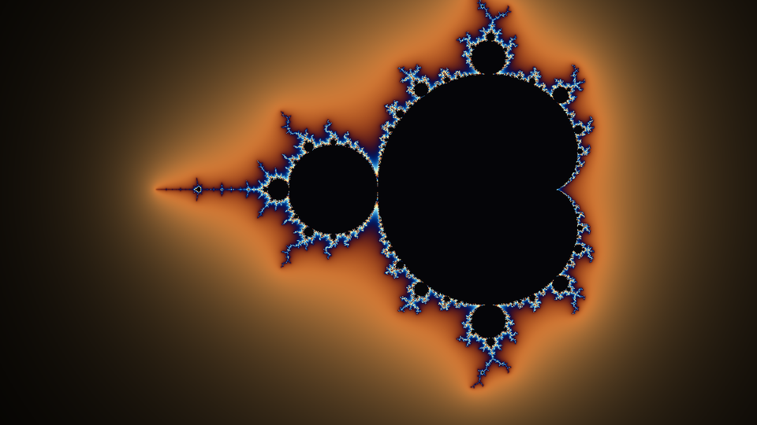
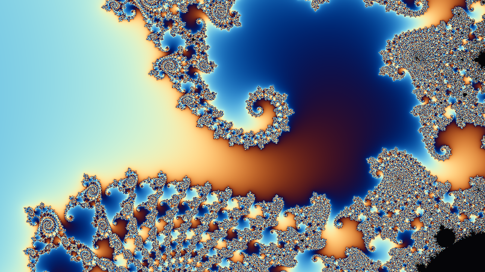
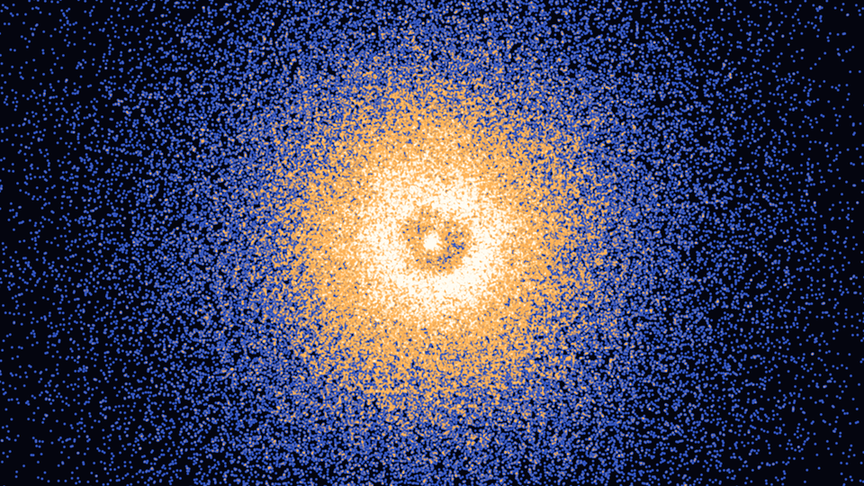
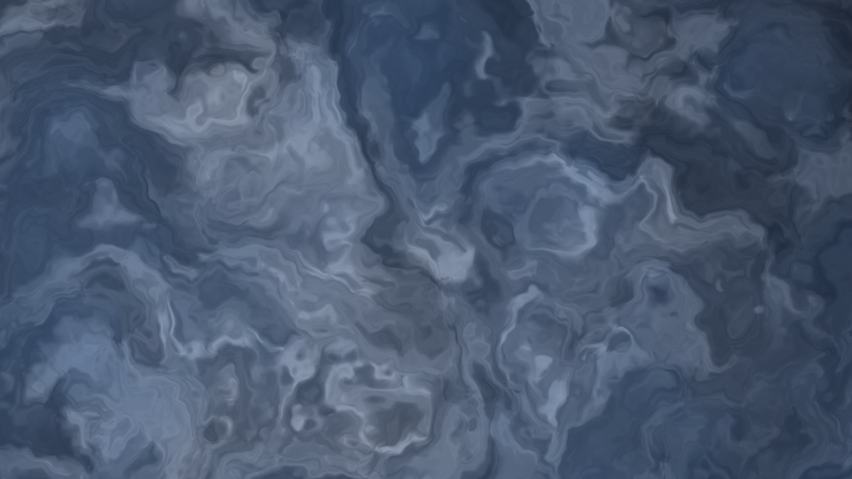

# vulkan-compute-lab

A Vulkan harness for writing GPU **compute** shaders and seeing them immediately.
Edit a `.comp` file, save, and the window updates — no rebuild, no restart.

There is no graphics pipeline anywhere in this project. Compute writes pixels to
an offscreen storage image, and that image is blitted straight to the swapchain.
No render pass, no framebuffers, no vertex or fragment stages.






*Every frame here was captured by the app itself with `--capture`. The middle one
is the same shader as the first, zoomed 400x.*

## Run it

```powershell
.\build.ps1 -Run
```

`build.ps1` locates VS Build Tools, imports the MSVC environment, and builds with
the CMake and Ninja that ship inside it — nothing needs to be on `PATH`.

```powershell
.\build.ps1 -Run -Shader shaders\warp.comp    # a different shader
.\build.ps1 -Config Release -Run              # no validation layers
```

Once it is built, launch the exe directly — faster, and it takes the flags below:

```powershell
.\build\Debug\lab.exe shaders\warp.comp
```

You do not rebuild to change a shader. Leave the window open, edit the `.comp`
file, save, and it swaps the pipeline within a frame or two. `build.ps1` is only
for C++ changes.

| | |
|---|---|
| drag | pan |
| scroll | zoom, about the cursor |
| `Home` | ease back to the default view |
| `R` | force a shader reload |
| `F12` | screenshot, filed per shader (see below) |
| `Esc` | quit |

`F12` writes to `screenshots/<shader>/<shader>-<timestamp>.png` inside the
project, so each shader accumulates its own directory. The directory is created
when the app starts and its path is printed to stdout, so you can find it before
taking the first capture:

```
screenshots/
  mandelbrot/mandelbrot-20260725-143012.png
  warp/warp-20260725-143288.png
```

Nothing is drawn into the frame to mark a capture — an overlay would be baked
into the image. The only feedback is a line on stdout. `screenshots/` is
gitignored; curated images belong in `docs/`.

Saving the shader file reloads it on its own; `R` is only for when you want to
re-run the compile without touching the file.

```
lab.exe [shader.comp] [--capture out.png] [--frames N] [--exit-after-capture]
                      [--center <x> <y>] [--zoom <z>] [--max-zoom <z>]
```

`--capture` is how the images in this README were made, and how the renderer gets
verified without a human looking at a window.

`--center` and `--zoom` set the starting view, so a capture can be framed
reproducibly instead of dragged there by hand:

```powershell
lab.exe --zoom 400 --capture deep.png --frames 30 --exit-after-capture
```

The PNG writer in `src/png.cpp` has no dependencies, which it pays for by using
stored (uncompressed) deflate blocks — a 1280x720 capture lands around 3.7 MB.
Correct PNG, just large; recompress anything you intend to share.

## Interaction

Two uniforms that look similar are deliberately kept apart, because mixing them
is what makes a viewport feel broken:

- **`mouse`** is the raw pointer, normalised, always live. It is only ever read,
  never re-anchored, so it cannot jump.
- **`center` and `zoom`** are navigation state, accumulated from cursor *deltas*.
  Pressing the button contributes exactly zero by construction, and on press the
  drag anchor is reset so the first frame of a drag cannot apply the distance the
  cursor travelled since the last drag ended.

The earlier version conflated the two — it fed the window centre into `mouse`
until a button went down, then the cursor position — and pressing the mouse
visibly teleported the image. Absolute values are fine to read and dangerous to
re-anchor; relative values are safe to accumulate. That is the whole rule.

Both are smoothed toward their targets with `1 - exp(-rate * dt)` rather than a
plain per-frame lerp, so the feel does not change with frame rate.

Zoom is applied about the cursor, not the window centre, which is the difference
between zooming *into what you are looking at* and having it slide out of frame.

### Why the view is stored as (centre, scale)

Internally the state is the view centre and `scale = 1/zoom`, and **both ease
with the same factor**. That pairing is not cosmetic — it is what makes zoom
anchoring exact. The anchor condition

```
centre == anchor - uv_cursor * scale
```

is affine in `scale`, so if both endpoints of the ease satisfy it, so does every
interpolated frame between them. The anchor is computed from the *displayed*
view rather than the target, which is what puts the starting point on that line.

The earlier version eased pan and log-zoom independently, and the anchor held
only at the endpoints. Simulating one three-click scroll gesture, the point under
the cursor drifted up to **6.9 pixels** mid-ease before settling back — the image
lurching toward the mouse. Under the current scheme the same simulation drifts
6e-14 pixels.

### The zoom ceiling

Zoom stops at a derived limit (**~38,800x** at 720p) because past it fp32 shader
coordinates quantize. Adjacent pixels differ by `scale / height`; once that step
drops below the float32 ULP of the coordinate itself, a whole neighbourhood
collapses onto one representable value:

```
scale / height   >   |p| * 2^-23
```

Beyond the limit the picture goes blocky and — worse — the view can only move in
whole lattice steps, so panning and zooming *snap* instead of sliding. Measured
on the shipped Mandelbrot: 30,000x is clean, 100,000x is visibly stepped, and
300,000x is coarse mush.

The limit assumes the shader's coordinate stays within ~0.3 uv units of the
origin, which holds for both shipped shaders. `--max-zoom <z>` overrides it and
`--max-zoom -1` removes it, if you want to see the artifacts or your shader is
conditioned differently.

Going genuinely deeper is a precision problem, not a limit that can be tuned
away: it needs fp64 coordinates (good to ~1e13, and roughly 1/32 rate on
consumer NVIDIA) or perturbation theory against a high-precision reference orbit.

## Simulations

A shader whose header carries a `//!nbody <count>` directive runs a different
path: instead of one dispatch per frame it becomes a four-pass simulation with
particle storage buffers behind it.

```powershell
.\build\Debug\lab.exe shaders\galaxy.comp
.\build\Debug\lab.exe shaders\galaxy.comp --particles 65536   # 4x faster
```

`galaxy.comp` is an N-body disk galaxy: an exponential stellar disk orbiting
inside a static dark-matter halo, integrated with exact all-pairs gravity.

| | |
|---|---|
| `Space` | reseed |
| `P` | pause the physics (the camera still works) |

All four passes live in one file behind `#ifdef` guards and are compiled from it
once each with `-D`, so the whole effect still reloads as a unit when you save:

```
SEED       one invocation per particle, writes initial conditions
INTEGRATE  one per particle, all-pairs force sum with shared-memory tiling
RENDER     one per particle, atomic splat into a count image
TONEMAP    one per pixel, counts -> colour, and zeroes the counts again
```

Seeding is a dispatch rather than a host upload, which means the initial
conditions are shader code too — nothing about the simulation is baked into C++
except the particle count, which only decides how big the buffers are. Editing
gravity or dispersion reloads the pipelines and **keeps the particles**, so the
disk changes behaviour in place without restarting.

### How large is "large"

All-pairs is O(N²) and exact — no tree, no approximation. Measured here on an
RTX 2080 SUPER at 1280x720:

| Bodies | Interactions / step | Frame rate |
|---|---|---|
| 32,768 | 1.1e9 | ~150 fps |
| 65,536 | 4.3e9 | ~79 fps |
| 131,072 | 1.7e10 | ~21 fps |

So this is a *tracer* galaxy: enough particles to resolve disk dynamics and
structure, not a star-for-star model of the 10⁸–10¹¹ a real galaxy has. Every
doubling costs 4x. Getting to millions needs Barnes-Hut or a particle-mesh
solver, which is a different project.

### The physics, and the two things that break it

Both of these produced obviously wrong pictures before they were fixed, and both
are the kind of error that looks like a rendering bug:

- **Seed velocities must match the *softened* force.** Inside the softening
  radius the real force is Plummer-softened and far weaker than `1/r²`. Seeding
  from ideal `√(GM/r)` gave core particles several times the speed they needed —
  the centre flung itself outward and left a hole with a bright ring around it.
  `circularSpeedSquared()` derives the curve from the force the integrator
  actually applies, and both terms go to zero at r→0 as a softened core should.
- **Toomre Q decides whether it is a galaxy or a clump swarm.**
  `Q = σ_R·κ / (3.36·G·Σ)`. Below 1 a disk fragments into bound clumps; well
  above it goes featureless. The first working version sat at Q ≈ 0.26 and
  promptly broke into half a dozen mini-galaxies.

The shipped constants sit safely above the threshold. **Crossing it is the
experiment worth running:** drop `DISPERSION` toward 0.30 or raise `DISK_MASS`
toward 1.0, save, and watch the disk destabilise in place over a few hundred
steps.

The disk is razor-thin 2D, so softening also stands in for the vertical
thickness that would otherwise help stabilise it. There is no gas and therefore
no dissipation, which is why spiral arms here are transient — they heat the disk
and fade, exactly as they do in pure N-body disk models.

## Writing a shader

Copy `shaders/mandelbrot.comp` and change the body. The contract is three things:

```glsl
layout(local_size_x = 16, local_size_y = 16) in;      // 256 threads per workgroup
layout(binding = 0, rgba8) uniform writeonly image2D target;

layout(push_constant) uniform Push {
    vec2  resolution;
    vec2  mouse;      // normalised 0..1, y down; always the live cursor
    vec2  center;     // view centre, in screen-height units at zoom 1
    float zoom;       // 1.0 at rest, larger as you scroll in
    float time;       // seconds since start
    float deltaTime;
    uint  frame;
} pc;
```

To make a shader navigable, map pixels through `center` and `zoom`:

```glsl
vec2 uv = (vec2(pixel) - 0.5 * pc.resolution) / pc.resolution.y;
vec2 p  = pc.center + uv / pc.zoom;
```

Offsetting *from* the centre rather than subtracting a growing pan is what keeps
this well conditioned. `uv / zoom` shrinks as you zoom in, so the sum never has
to represent a small difference between two large numbers.

If the shader resolves more detail as it zooms — anything iterative — scale the
work with `zoom`, or deep views quietly degrade. `mandelbrot.comp` does this:

```glsl
int maxIter = int(min(2000.0, 320.0 + 140.0 * log2(max(pc.zoom, 1.0))));
```

Guard against the overhang — the dispatch is rounded up to whole workgroups, so
the last row and column of invocations sit outside the image:

```glsl
ivec2 pixel = ivec2(gl_GlobalInvocationID.xy);
if (pixel.x >= int(pc.resolution.x) || pixel.y >= int(pc.resolution.y)) return;
```

A shader that fails to compile prints the `glslc` diagnostic and leaves the
previous pipeline running, so a typo does not kill the session.

## How a frame works

```
wait frame fence
acquire swapchain image                         -> semaphore
  storage image  UNDEFINED     -> GENERAL       (barrier)
  dispatch  ceil(w/16) x ceil(h/16) workgroups
  storage image  GENERAL       -> TRANSFER_SRC  (barrier)
  swapchain img  UNDEFINED     -> TRANSFER_DST  (barrier)
  blit  storage image -> swapchain image
  swapchain img  TRANSFER_DST  -> PRESENT_SRC   (barrier)
submit (waits on acquire at TRANSFER)           -> semaphore
present
```

Decisions worth knowing about, because they are the ones that bite:

- **One queue** for compute, transfer and present. No queue-family ownership
  transfers to reason about.
- **A storage image per frame in flight.** Sharing one target lets frame N's
  dispatch overwrite pixels that frame N-1 is still blitting.
- **Present semaphores are per swapchain image, not per frame in flight.**
  Present consumes them asynchronously; a frame-indexed semaphore can still be
  pending when that frame slot comes around again.
- **`UNDEFINED` as the storage image's old layout** each frame, which discards
  the previous contents. That is right for a shader that writes every pixel and
  wrong for a ping-pong effect — those need the old layout preserved.
- **Blit, not copy.** The target is `R8G8B8A8_UNORM` and the swapchain is usually
  `B8G8R8A8_UNORM`; only a blit converts between them. A copy would swap R and B.
- **A non-sRGB swapchain format** is preferred, so the 8-bit values the shader
  writes reach the screen unchanged instead of picking up an extra encode.

## Layout

```
src/
  context.cpp          instance, debug messenger, device, queue, command pool
  swapchain.cpp        surface format/present mode choice, present-only swapchain
  shader_compiler.cpp  runs glslc at runtime; this is what makes reload work
  app.cpp              storage images, descriptors, pipeline, frame loop,
                       navigation, capture
  png.cpp              dependency-free PNG writer for screenshots
  simulation.cpp       particle buffers, four-pass N-body path, accumulation images
shaders/
  mandelbrot.comp      smooth-iteration Mandelbrot, iteration count scaled by zoom
  warp.comp            domain-warped value noise
  galaxy.comp          N-body disk galaxy in a dark-matter halo (four passes)
docs/                  README captures, produced with --capture
```

Shaders are compiled at **runtime**, not build time — that is the whole point of
the reload loop. It means the Vulkan SDK's `glslc` has to be present when the app
runs, not just when it builds.

## Requirements

- A Vulkan 1.3 GPU and driver
- [LunarG Vulkan SDK](https://vulkan.lunarg.com/) — headers, `glslc`, validation layers
- MSVC with the C++ workload (VS 2022 or Build Tools), CMake 3.24+, Ninja
- GLFW is fetched automatically by CMake; there are no vendored dependencies

Debug builds enable `VK_LAYER_KHRONOS_validation` and print warnings and errors
to stderr. Development happens with them on.

## Next

- [x] Storage buffers: an N-body particle system, dispatch over particles rather than pixels
- [x] Shared-memory tiling, to show `local_size` and cache behaviour mattering
- [ ] Barnes-Hut or particle-mesh, to get past the O(N²) ceiling into the millions
- [ ] A colliding pair of galaxies — two seeded disks on a hyperbolic encounter
- [ ] Ping-pong images for stateful simulation (reaction-diffusion, fluid)
- [ ] A raymarched SDF scene with soft shadows
- [ ] Timestamp queries, to report actual GPU dispatch time instead of frame rate
